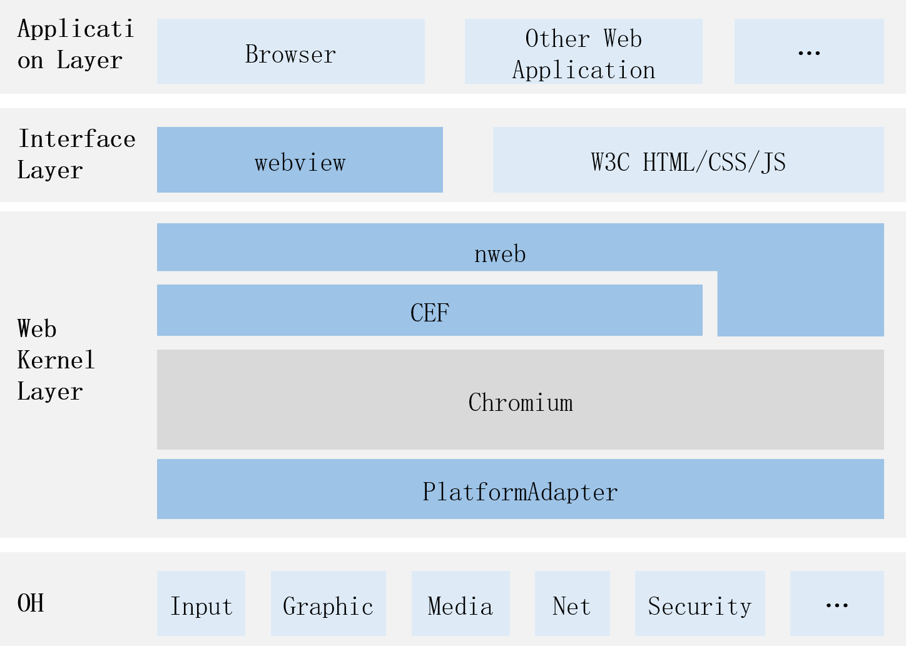

# web_webview
## Introduction
nweb is the native engine of the OpenHarmony webview component and is built based on Chromium and the Chromium Embedded Framework (CEF).
## Software Architecture
Below is the software architecture.

* Webview component: UI component in OpenHarmony.
* nweb: native engine of the OpenHarmony web component, which is built based on the Chromium Embedded Framework (CEF).
* CEF: stands for Chromium Embedded Framework. It is an open-source project based on Google Chromium.
* Chromium: an open-source web browser principally developed by Google and released under the BSD license and other permissive open-source licenses.
 ## Directory Structure
```
.
├── ohos_nweb            # OpenHarmony adaptation code
│   ├── include
│   ├── prebuilts        # NWeb.hap, built based on the third_party_chromium source code repository
│   └── src
└── test                 # nwebview test code
```

## Repositories Involved

[ace_ace_engine](https://gitee.com/openharmony/arkui_ace_engine)

[third_party_cef](https://gitee.com/openharmony/third_party_cef)

**[web_webview](https://gitee.com/openharmony/web_webview)**

[third_party_chromium](https://gitee.com/openharmony/third_party_chromium)
