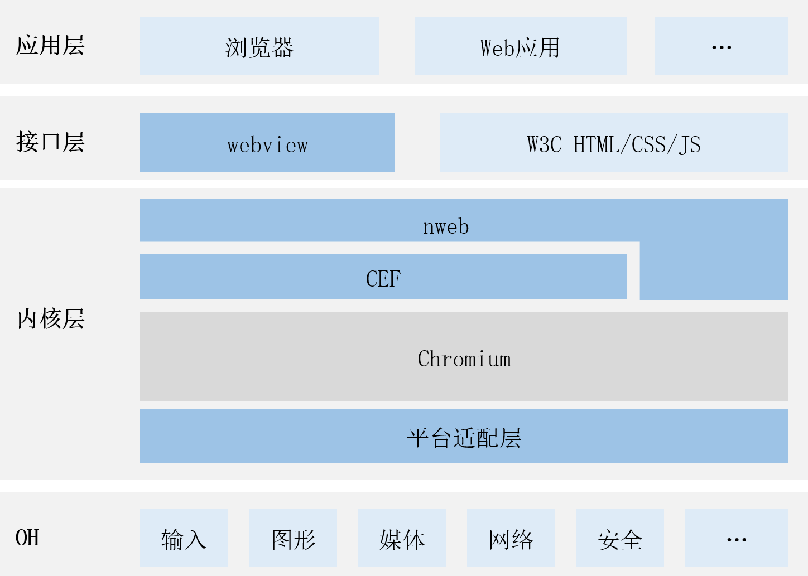

# web_webview
- [简介](#简介)
- [目录](#目录)
- [相关仓](#相关仓)
## 简介
### 内容介绍
nweb是OpenHarmony webview组件的Native引擎，基于Chromium和CEF构建。
### 软件架构
软件架构说明

* webview组件：OpenHarmony的UI组件。
* nweb：基于CEF构建的OpenHarmony web组件的Native引擎。
* CEF：CEF全称Chromium Embedded Framework，是一个基于Google Chromium 的开源项目。
* Chromium： Chromium是一个由Google主导开发的网页浏览器。以BSD许可证等多重自由版权发行并开放源代码。
 ## 目录
```
.
├── ohos_nweb            # openharmony适配代码
│   ├── include
│   ├── prebuilts        # NWeb.hap，基于third_party_chromium源码仓构建
│   └── src
└── test                 # nwebview测试代码
```

## 相关仓

[ace_ace_engine](https://gitee.com/openharmony/arkui_ace_engine)

[third_party_cef](https://gitee.com/openharmony/third_party_cef)

**[web_webview](https://gitee.com/openharmony/web_webview)**

[third_party_chromium](https://gitee.com/openharmony/third_party_chromium)